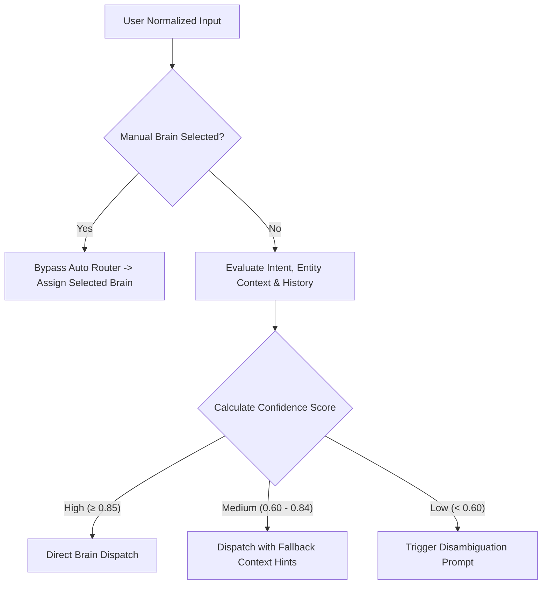

# WeatherGPT — LLM & Domain Brain Specification

**Document:** `03_LLM_BRAIN_SPEC.md`  
**Status:** Approved Technical Specification  
**Primary PRD Reference:** [docs/01_PRD.md](01_PRD.md)  
**Related Specs:** [02_SYSTEM_ARCHITECTURE.md](02_SYSTEM_ARCHITECTURE.md), [04_INPUT_OUTPUT_CONTRACT.md](04_INPUT_OUTPUT_CONTRACT.md), [05_TOOL_REGISTRY.md](05_TOOL_REGISTRY.md)

---

## 1. LLM Role & System Boundaries

In WeatherGPT, the Large Language Model (LLM) is strictly defined as an **Orchestration, Semantic Understanding, and Explanation Layer**. It is **not** a meteorological model or an arbitrary calculation engine.

```text
┌─────────────────────────────────────────────────────────────────────────────┐
│                             LLM RESPONSIBILITIES                            │
├─────────────────────────────────────────────────────────────────────────────┤
│  ✅ Parse complex natural language, colloquialisms, and code-mixed queries  │
│  ✅ Extract structured intents, parameters, and entities                    │
│  ✅ Select and orchestrate tools through the Tool Gateway                   │
│  ✅ Ingest structured evidence packages (observations, stats, GIS layers)   │
│  ✅ Translate analytical results into clear, role-tailored explanations     │
│  ✅ Format final responses into the unified JSON output contract            │
│  ✅ Maintain multilingual nuance across English, Hindi, Bengali, Marathi,   │
│     and Gujarati without mutating numerical evidence                        │
└─────────────────────────────────────────────────────────────────────────────┘
                                      ▲
                                 HARD BOUNDARY
                                      ▼
┌─────────────────────────────────────────────────────────────────────────────┐
│                           LLM NON-RESPONSIBILITIES                          │
├─────────────────────────────────────────────────────────────────────────────┤
│  ❌ NEVER fabricate or invent weather values (temperatures, rainfall, etc.) │
│  ❌ NEVER calculate mathematical statistics, trends, or $ET_0$ values      │
│  ❌ NEVER alter, downgrade, or fabricate official IMD weather alerts        │
│  ❌ NEVER invent spatial coordinates or administrative intersections        │
│  ❌ NEVER generate unsupported agricultural chemical prescriptions          │
│  ❌ NEVER claim ungrounded probability values from raw model spread         │
└─────────────────────────────────────────────────────────────────────────────┘
```

---

## 2. Auto Router Specification

The Auto Router is the intelligent gateway responsible for analyzing the user's natural language input, conversation state, location context, and intent to route the query to the most appropriate Domain Brain.

### 2.1 Routing Decision Engine
The router does not rely on naive keyword matching. It uses an intent classification prompt with few-shot exemplars combined with rule-based heuristics.



### 2.2 Routing States & Confidence Thresholds
| Confidence Level | Score Range | System Action | Example Query |
| :--- | :--- | :--- | :--- |
| **High Confidence** | $\ge 0.85$ | Directly executes the targeted Brain workflow. | *"Will it rain tomorrow in Pune?"* $\rightarrow$ General<br>*"Can I spray imidacloprid on my cotton tomorrow in Rajkot?"* $\rightarrow$ Farmer |
| **Medium Confidence** | $0.60 - 0.84$ | Dispatches to the highest-scoring Brain but includes fallback context in the system prompt. | *"Rainfall trends in Nagpur"* $\rightarrow$ Researcher Brain (with General Brain fallback) |
| **Low Confidence** | $< 0.60$ | Emits an immediate conversational disambiguation card asking the user for intent clarity. | *"What is the weather risk in Surat?"* $\rightarrow$ Disambiguation Prompt |

#### Disambiguation Prompt Card Structure (Low Confidence)
```json
{
  "type": "disambiguation_request",
  "message": "To give you the most accurate insight, please choose what you would like to analyze:",
  "options": [
    {"label": "General Weather & Alerts", "target_brain": "general"},
    {"label": "Farming & Crop Advisory", "target_brain": "farmer"},
    {"label": "Historical & Climate Analysis", "target_brain": "researcher"},
    {"label": "Infrastructure & Disaster Risk", "target_brain": "analyst"}
  ]
}
```

### 2.3 Contextual Brain Switching
The router tracks conversation state across turns. When the user pivots intent, the router seamlessly switches the Brain while preserving shared context (location, date window):
1. **Turn 1 (General):** *"What is the temperature and rain forecast in Ludhiana for the next 3 days?"* $\rightarrow$ **General Brain** resolves Ludhiana, pulls 3-day forecast.
2. **Turn 2 (Farmer Pivot):** *"Should I irrigate my wheat given this forecast?"* $\rightarrow$ Router detects crop entity (`wheat`) and agronomic decision goal (`irrigation`), switching to **Farmer Brain** while inheriting location (`Ludhiana`) and temporal window (`next 3 days`).

---

## 3. General Brain Specification

### 3.1 Purpose & Role
Provides straightforward, reliable everyday weather information, short-term forecasts, official IMD alerts, and lifestyle weather advisories for citizens without technical jargon.

### 3.2 Workflow Architecture
$$\text{User Query} \longrightarrow \text{Geocoding/Date Parse} \longrightarrow \text{Weather/Alert Tools} \longrightarrow \text{Evidence Validation} \longrightarrow \text{LLM Explanation} \longrightarrow \text{Weather Card + Text}$$

* **Allowed Tools:** `resolve_location`, `get_current_weather`, `get_forecast`, `get_rainfall`, `get_weather_alerts`.
* **Required Context:** Valid location coordinates (or resolved city name), temporal window (defaults to "current + 3 days").
* **Key Guardrail:** If an IMD warning is active (e.g., Orange/Red Alert for heavy downpour), the warning must be headlined verbatim in the summary card before conversational commentary.

---

## 4. Farmer Brain Specification

### 4.1 Purpose & Role
Converts meteorological forecasts and agrometeorological parameters into actionable agricultural decision support, specifically addressing irrigation scheduling, chemical spraying suitability, and extreme weather crop protection.

### 4.2 Workflow Architecture
$$\text{Farmer Question} + \text{Crop Metadata} \longrightarrow \text{Weather + Ag Tools} \longrightarrow \text{Deterministic Rules (}ET_0\text{/Water Balance/Spray)} \longrightarrow \text{Evidence Package} \longrightarrow \text{LLM Advisory}$$

* **Allowed Tools:** `get_crop_profile`, `get_crop_stage_context`, `get_soil_context`, `get_irrigation_context`, `get_forecast`, `get_weather_alerts`, `calculate_irrigation_advisory`, `check_spray_window`, `get_crop_weather_risk`.
* **Personalization & Context Hierarchy:**
  * *Critical Required Context:* Crop Name, Farm Location.
  * *Progressive Context (Requested only if missing and required for calculation):* Crop Growth Stage, Sowing Date, Soil Type, Last Irrigation Date.
* **Deterministic Computations:**
  * **Reference Evapotranspiration ($ET_0$):** Calculated via FAO-56 Penman-Monteith equation in the analytics engine.
  * **Crop Evapotranspiration ($ET_c$):** $ET_c = K_c \times ET_0$.
  * **Spray Window Logic:** Evaluates forecasted wind speed ($< 15\text{ km/h}$), rain probability ($< 30\%$), and no rain within 4 hours post-application.
* **Safety Guardrail:** If critical crop context is absent for an irreversible operational decision (e.g., spraying during flowering or high-dose fertilization), the Brain must refuse a definitive "Yes/No" and ask for the missing parameter.

---

## 5. Researcher Brain Specification

### 5.1 Purpose & Role
Enables rigorous, reproducible historical climate analysis, multi-year anomaly detection, trend calculations, period comparisons, and dataset exports.

### 5.2 Workflow Architecture
$$\text{Research Query} \longrightarrow \text{Dataset & Time Horizon Resolution} \longrightarrow \text{Historical Data Retrieval} \longrightarrow \text{Statistical Engine} \longrightarrow \text{Provenance & Visualization Spec} \longrightarrow \text{LLM Synthesis}$$

* **Allowed Tools:** `get_historical_weather`, `get_dataset_metadata`, `run_statistics`, `run_correlation`, `compare_periods`, `compare_locations`, `generate_dataset`, `export_dataset`.
* **Required Provenance Elements:** Every researcher output must return:
  1. Primary Dataset Name & Source (e.g., IMD Gridded 0.25°, ERA5 Reanalysis).
  2. Temporal Range & Missing Data Ratio ($< 5\%$ allowed for valid trend).
  3. Statistical Method Used (e.g., Mann-Kendall S-statistic, Sen's slope estimator, Pearson/Spearman $r$).
  4. P-value / Statistical Significance level ($\alpha = 0.05$).
* **Visualization Output:** Emits a declarative chart specification (e.g., time-series line chart with linear regression overlay and confidence bands) rather than generating visual pixels.

---

## 6. Analyst Brain Specification

### 6.1 Purpose & Role
Delivers operational weather risk intelligence, hazard-exposure-vulnerability quantification, multi-NWP model comparison, and spatial impact assessments for disaster managers, planners, and enterprise operators.

### 6.2 Workflow Architecture
$$\text{Analyst Query} \longrightarrow \text{Weather/Warning Ingest} + \text{NWP Grid} + \text{GIS Layers} \longrightarrow \text{Spatial Join (PostGIS)} \longrightarrow \text{Deterministic Risk Matrix} \longrightarrow \text{Evidence Package} \longrightarrow \text{Map/Dashboard Spec}$$

* **Allowed Tools:** `get_current_weather`, `get_forecast`, `get_weather_alerts`, `get_nwp_data`, `compare_models`, `run_gis_analysis`, `get_exposure`, `intersect_hazard`, `run_anomaly_analysis`, `run_risk_analysis`, `generate_map`, `generate_dashboard`.
* **Risk Formulation Principle:**
  $$\text{Risk} = \text{Hazard (Deterministic Historical Percentile)} \times \text{Exposure (GIS Intersect)} \times \text{Vulnerability}$$
* **Multi-Model Intelligence:** When comparing GFS, ECMWF, and IMD NWP streams, the Brain explicitly states **Model Agreement / Spread** (High / Medium / Low) and highlights geographic zones of divergence. It never claims an arbitrary consensus probability without statistical calibration.

---

## 7. Evidence Package & Prompt Engineering Structure

The LLM is prompted strictly through a structured **Evidence Package** injected into the system/user context.

### 7.1 Unified Evidence Package Structure
```json
{
  "evidence_id": "ev_89f72b14",
  "generated_at": "2026-08-29T06:00:00Z",
  "location": {
    "name": "Ahmedabad",
    "district": "Ahmedabad",
    "state": "Gujarat",
    "coordinates": {"lat": 23.0225, "lon": 72.5714}
  },
  "temporal_context": {
    "reference_time_ist": "2026-08-29 11:30:00+05:30",
    "target_window_start": "2026-08-30T00:00:00Z",
    "target_window_end": "2026-08-30T23:59:59Z"
  },
  "official_alerts": [
    {
      "source": "IMD",
      "warning_level": "Yellow",
      "hazard": "Heavy Rainfall",
      "description": "Heavy rainfall at isolated places over Ahmedabad district.",
      "valid_until": "2026-08-31T08:30:00+05:30"
    }
  ],
  "tool_results": {
    "forecast": {
      "provider": "IMD / GFS Blend",
      "temperature_max_c": 33.5,
      "temperature_min_c": 26.2,
      "rainfall_total_mm": 28.4,
      "rain_probability_pct": 75,
      "wind_speed_kmh": 18.2
    },
    "deterministic_analysis": {
      "irrigation_advisory": {
        "action": "POSTPONE",
        "reason": "Forecast rainfall of 28.4mm exceeds crop water deficit (5.2mm).",
        "confidence_factors": ["Adequate forecast agreement", "Soil moisture high"]
      }
    }
  },
  "provenance": [
    {"dataset": "IMD District Bulletin", "retrieved_at": "2026-08-29T05:30:00Z"},
    {"dataset": "GFS 0.25° Run 00z", "retrieved_at": "2026-08-29T04:15:00Z"}
  ]
}
```

### 7.2 System Instruction Template (Farmer Brain Example)
```text
You are the Farmer Brain of WeatherGPT.
Your objective is to provide actionable, clear agricultural decision guidance based exclusively on the provided Evidence Package.

STRICT OPERATIONAL RULES:
1. GROUNDING: Cite only temperatures, rainfall amounts, and wind speeds provided in the Evidence Package. Never invent values.
2. DETERMINISTIC GUIDANCE: Use the exact 'action' and 'reason' from 'deterministic_analysis.irrigation_advisory'. Do not contradict deterministic calculations.
3. OFFICIAL WARNINGS: If official_alerts are present, highlight the IMD alert level (Yellow/Orange/Red) prominently.
4. LANGUAGE: Respond in the user's requested language. Keep numerical values and units (mm, °C, km/h) exact.
5. MISSING CONTEXT: If critical context is marked as null and hinders advice, ask for it politely without answering ambiguously.
```

---

## 8. Concrete Query Walkthrough Traces

### Trace 1: General Brain Query
* **User Query:** *"What is the weather in Pune tomorrow, and will I need an umbrella?"*
* **Router Execution:** `intent = "daily_forecast"`, `location = "Pune"`, `date = "tomorrow"`, `confidence = 0.96` $\rightarrow$ **General Brain**.
* **Tools Called:** `resolve_location(name="Pune")`, `get_forecast(lat=18.5204, lon=73.8567, window="2026-08-30")`, `get_weather_alerts(lat=18.5204, lon=73.8567)`.
* **Evidence Package:** `temp_max: 29.1°C, temp_min: 22.4°C, rain_total: 18.5mm, rain_prob: 85%, imd_alert: Green`.
* **LLM Output:** Explains that light-to-moderate rain is highly likely ($85\%$ probability, $18.5\text{ mm}$), recommends carrying an umbrella, and renders a Weather Card with hourly precipitation breakdown.

### Trace 2: Farmer Brain Progressive Personalization Trace
* **User Query:** *"Should I spray pesticide tomorrow in Nashik?"*
* **Router Execution:** `intent = "spray_advisory"`, `location = "Nashik"`, `date = "tomorrow"`, `crop = null`, `confidence = 0.92` $\rightarrow$ **Farmer Brain**.
* **Context Check:** Brain determines location is resolved, but target crop/chemical context is missing.
* **Brain Execution:** Calls `get_forecast(Nashik, tomorrow)`. Evidence indicates $35\text{ km/h}$ gusty winds and $65\%$ rain probability.
* **Deterministic Rule:** Spray window evaluation fails unconditionally due to high wind ($> 15\text{ km/h}$) and rain probability ($> 30\%$) regardless of crop.
* **LLM Output:** *"Spraying is **not recommended** tomorrow in Nashik because forecast wind speeds ($35\text{ km/h}$) and rain probability ($65\%$) will cause chemical wash-off and spray drift. If you need advice on a specific crop or target pest, please tell me which crop you are treating."* (Avoids redundant blocking while delivering safe advisory).
