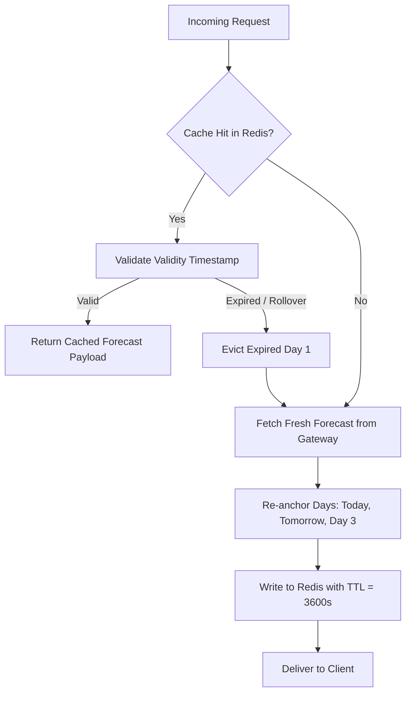

# WeatherGPT — Weather Data Specification

**Document:** `07_WEATHER_DATA_SPEC.md`  
**Status:** Approved Technical Specification  
**Primary PRD Reference:** [docs/01_PRD.md](01_PRD.md)  
**Related Specs:** [05_TOOL_REGISTRY.md](05_TOOL_REGISTRY.md), [08_NWP_SPEC.md](08_NWP_SPEC.md), [15_ERROR_GUARDRAILS.md](15_ERROR_GUARDRAILS.md)

---

## 1. Meteorological Authority & Source Strategy

WeatherGPT operates on an authoritative data hierarchy tailored for India.

```text
┌────────────────────────────────────────────────────────────────────────────┐
│                    METEOROLOGICAL AUTHORITY HIERARCHY                      │
├────────────────────────────────────────────────────────────────────────────┤
│ 1. PRIMARY & AUTHORITATIVE: India Meteorological Department (IMD)          │
│    • Official District Warnings (CAP alerts, Color Codes)                  │
│    • Nowcasts & Severe Weather Bulletins                                   │
│    • Agrometeorological Advisories (AAS - Gramin Krishi Mausam Sewa)       │
│    • Gridded Historical Rainfall & Temperature Baselines                   │
├────────────────────────────────────────────────────────────────────────────┤
│ 2. SECONDARY / OPERATIONAL NUMERICAL PROVIDERS (Modular Adapters)         │
│    • GFS (Global Forecast System - NOAA/NCEP 0.25°)                        │
│    • Open-Meteo / ECMWF IFS Open Data (High-resolution surface parameters) │
│    • ERA5 Reanalysis (Historical baseline fallback)                        │
└────────────────────────────────────────────────────────────────────────────┘
```

> [!IMPORTANT]
> **Authoritative Warning Rule:** Secondary data providers supply continuous numerical variables (e.g. hourly temperature curves, relative humidity). However, **secondary providers never override or fabricate official IMD weather warnings**. If IMD is unreachable, the system clearly communicates that live official IMD warning status is temporarily unavailable.

### 1.1 IMD Integration Status & Proposed Technical Decisions
* **[Proposed Technical Decision]**: IMD integration uses the National Disaster Management Authority (NDMA) Sachet CAP feed, IMD District Weather Bulletins (public RSS/JSON endpoints), and IMD AWS/ARG surface telemetry.
* **[Open Decision]**: Official direct API keys, rate limits, and enterprise SLA access terms with IMD/MoES remain subject to institutional onboarding agreements. If direct authenticated API access is restricted during early MVP staging, the system falls back to public CAP feeds and secondary numerical NWP adapters.

---

## 2. Standardized Meteorological Variables & Units

All internal layers store, calculate, and pass data using standard metric units.

| Parameter | Internal Variable Name | Standard Unit | Valid Range | Resolution |
| :--- | :--- | :---: | :---: | :---: |
| Surface Temperature | `temperature_c` | °C | $-20.0$ to $55.0$ | $0.1$ |
| Apparent Temperature | `feels_like_c` | °C | $-25.0$ to $65.0$ | $0.1$ |
| Daily Max Temperature | `temperature_max_c` | °C | $-15.0$ to $55.0$ | $0.1$ |
| Daily Min Temperature | `temperature_min_c` | °C | $-25.0$ to $40.0$ | $0.1$ |
| Relative Humidity | `relative_humidity_pct`| % | $0$ to $100$ | $1$ |
| Precipitation Total | `precipitation_mm` | mm | $0.0$ to $1200.0$| $0.1$ |
| Precipitation Probability| `rain_probability_pct`| % | $0$ to $100$ | $1$ |
| Wind Speed (10m) | `wind_speed_kmh` | km/h | $0.0$ to $300.0$ | $0.1$ |
| Wind Gust | `wind_gust_kmh` | km/h | $0.0$ to $350.0$ | $0.1$ |
| Wind Direction | `wind_direction_deg` | ° (azimuth) | $0$ to $360$ | $1$ |
| Atmospheric Pressure | `surface_pressure_hpa`| hPa | $800.0$ to $1080.0$| $0.1$ |
| Solar Radiation | `solar_radiation_w_m2` | $\text{W/m}^2$| $0.0$ to $1400.0$| $1.0$ |

---

## 3. Official Classification Standards

### 3.1 IMD Rainfall Intensity Categories
WeatherGPT strictly maps 24-hour accumulated rainfall values to standard IMD terminology:

| IMD Category | 24-Hour Rainfall Range ($R$) | System Label |
| :--- | :--- | :--- |
| **No Rain** | $R = 0.0\text{ mm}$ | `no_rain` |
| **Very Light Rain** | $0.1\text{ mm} \le R \le 2.4\text{ mm}$ | `very_light_rain` |
| **Light Rain** | $2.5\text{ mm} \le R \le 15.5\text{ mm}$ | `light_rain` |
| **Moderate Rain** | $15.6\text{ mm} \le R \le 64.4\text{ mm}$ | `moderate_rain` |
| **Heavy Rain** | $64.5\text{ mm} \le R \le 115.5\text{ mm}$ | `heavy_rain` |
| **Very Heavy Rain** | $115.6\text{ mm} \le R \le 204.4\text{ mm}$| `very_heavy_rain` |
| **Extremely Heavy Rain** | $R \ge 204.5\text{ mm}$ | `extremely_heavy_rain` |

### 3.2 IMD Warning Color Code Standards

| Alert Color | IMD Meaning | Required Action Guidance | Severity Level |
| :--- | :--- | :--- | :---: |
| **Green** | Clear / No Warning | No advisory action needed. Normal routine. | 0 |
| **Yellow** | Watch / Be Updated | Monitor weather updates; conditions may deteriorate. | 1 |
| **Orange** | Alert / Be Prepared | Prepare for disruption; high probability of severe weather. | 2 |
| **Red** | Warning / Take Action | Emergency action required; severe risk to life and property. | 3 |

---

## 4. Provider Abstraction Architecture

```text
┌────────────────────────────────────────────────────────────────────────────┐
│                        WEATHER PROVIDER ADAPTER LAYER                      │
└─────────────────────────────────────┬──────────────────────────────────────┘
                                      ▼
             ┌──────────────────────────────────────────────────┐
             │       BaseWeatherAdapter (Abstract Base Class)   │
             │   + get_current(lat, lon) -> NormalizedObs       │
             │   + get_forecast(lat, lon, days) -> ForecastData │
             │   + get_alerts(district/lat, lon) -> AlertData   │
             └────────┬─────────────────┬─────────────────┬─────┘
                      │                 │                 │
     ┌────────────────▼───┐    ┌────────▼───────────┐    ┌▼──────────────────┐
     │     IMDAdapter     │    │     GFSAdapter     │    │  OpenMeteoAdapter │
     │  (Authoritative)   │    │ (NOAA Global 0.25°)│    │    (Secondary)    │
     └────────────────────┘    └────────────────────┘    └───────────────────┘
```

### 4.1 Ingestion & Priority Cascade
When a query requests weather data for $(\text{lat}, \text{lon})$:
1. **Warnings & Official Bulletins:** `IMDAdapter` is queried. If cached or live IMD feed exists, return IMD warning.
2. **Current Surface Telemetry:** `IMDAdapter` (AWS/ARG station if station $< 25\text{ km}$); fallback to `OpenMeteoAdapter` / `GFSAdapter`.
3. **Forecast (1–7 Days):** Multi-source normalized forecast combining IMD district quantitative guidance and GFS hourly numerical parameters.

---

## 5. Three-Day Rolling Forecast Cache & Rollover Logic

To optimize latency, reduce external API calls, and maintain instantaneous response times for mobile users, the backend maintains a **3-Day Rolling Forecast Cache** in Redis.



### 5.1 Midnight Rollover Rules (IST)
1. **Reference Timezone:** India Standard Time (`UTC+05:30`).
2. **Rollover Trigger:** At `00:00:01 IST`, the day designated as "Today" expires and transitions to the historical observation record.
3. **Cache Re-Indexing:**
   * Old "Tomorrow" becomes new "Today".
   * Old "Day After Tomorrow" becomes new "Tomorrow".
   * New "Day 3" forecast is fetched from the NWP/Weather adapter and populated.
4. **Staleness Protection:** A cache key is marked stale if its creation time exceeds $3\text{ hours}$. If live fetch fails, stale cache is served with an explicit `is_stale: true` warning header.

---

## 6. Data Provenance & Auditing Schema

Every meteorological response payload returned to the LLM or frontend must contain a complete `provenance` envelope:

```json
{
  "provenance": {
    "source_id": "IMD_PWS_DISTRICT_721",
    "provider_name": "India Meteorological Department",
    "retrieved_at_utc": "2026-08-29T06:00:00Z",
    "model_cycle": "2026-08-29 00z",
    "validity_window": {
      "start": "2026-08-29T06:00:00Z",
      "end": "2026-09-01T06:00:00Z"
    },
    "spatial_resolution": "0.25 degree (~27 km)",
    "interpolation_applied": "bilinear_grid_to_point",
    "data_quality_flags": {
      "missing_variables_interpolated": false,
      "sensor_qc_passed": true
    }
  }
}
```
