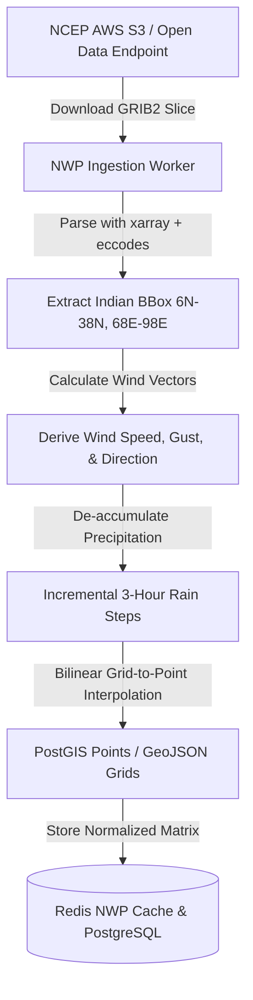

# WeatherGPT — Numerical Weather Prediction (NWP) Specification

**Document:** `08_NWP_SPEC.md`  
**Status:** Approved Technical Specification  
**Primary PRD Reference:** [docs/01_PRD.md](01_PRD.md)  
**Related Specs:** [02_SYSTEM_ARCHITECTURE.md](02_SYSTEM_ARCHITECTURE.md), [07_WEATHER_DATA_SPEC.md](07_WEATHER_DATA_SPEC.md), [11_ANALYTICS_ENGINE.md](11_ANALYTICS_ENGINE.md)

---

## 1. NWP Role & Explicit System Boundaries

In WeatherGPT, Numerical Weather Prediction (NWP) models provide physics-based prognostic atmospheric fields.

```text
┌────────────────────────────────────────────────────────────────────────────┐
│                             NWP CORE PRINCIPLES                            │
├────────────────────────────────────────────────────────────────────────────┤
│  ✅ WeatherGPT CONSUMES and NORMALIZES external NWP model data              │
│  ✅ WeatherGPT COMPUTES deterministic multi-model spread and divergence    │
│  ✅ WeatherGPT INTERPOLATES grid fields to specific point/polygon contexts │
│  ❌ WeatherGPT DOES NOT train, initialize, or execute national WRF models  │
│  ❌ The LLM DOES NOT perform numerical atmospheric simulation             │
│  ❌ Model spread is NEVER described as a mathematically calibrated          │
│     scientific probability without verified ensemble calibration           │
└────────────────────────────────────────────────────────────────────────────┘
```

> [!IMPORTANT]
> **Operational WRF Scope Boundary:** The MVP architecture explicitly excludes running an operational WRF (Weather Research and Forecasting) computing cluster due to compute, data assimilation, and validation overhead. If trusted external research partners provide pre-computed WRF GRIB2/NetCDF files via HTTP/S3, the system ingests them via a standard modular adapter.

---

## 2. Supported NWP Data Streams

| Model Stream | Sponsoring Agency | Horizontal Resolution | Run Cycles (UTC) | Forecast Horizon | Ingestion Format | MVP Status |
| :--- | :--- | :---: | :---: | :---: | :---: | :---: |
| **GFS 0.25°** | NOAA / NCEP | $0.25^\circ\ (\sim 27\text{ km})$ | 00z, 06z, 12z, 18z | 0–120 hours | GRIB2 / OpenDAP / API | **Core MVP Stream** |
| **ECMWF IFS Open**| ECMWF | $0.25^\circ\ (\sim 27\text{ km})$ | 00z, 12z | 0–96 hours | GRIB2 / Open-Meteo API| **Secondary MVP Stream**|
| **External WRF** | Partner/Collaborator | $0.03^\circ\ (\sim 3\text{ km})$ | On Availability | 0–48 hours | NetCDF4 / GRIB2 | Modular Adapter (Post-MVP)|

---

## 3. Ingested Atmospheric Variables

The NWP ingestion pipeline extracts and validates the following physical surface and pressure-level parameters:

| GRIB2 Short Name | Parameter Description | Units | Processing / Derived Metrics |
| :--- | :--- | :---: | :--- |
| `TMP:2 m above ground` | 2-Meter Air Temperature | K $\rightarrow$ °C | Converted to Celsius ($T_{^{\circ}\text{C}} = T_{\text{K}} - 273.15$) |
| `RH:2 m above ground` | 2-Meter Relative Humidity | % | Clamped to range $[0, 100]$ |
| `APCP:surface` | Total Accumulated Precipitation | $\text{kg/m}^2$ (mm)| De-accumulated to hourly/3-hourly incremental rain |
| `UGRD:10 m above ground`| 10-Meter U-Wind Component | m/s | Used to derive horizontal wind speed & direction |
| `VGRD:10 m above ground`| 10-Meter V-Wind Component | m/s | Used to derive horizontal wind speed & direction |
| `GUST:surface` | Surface Wind Gust | m/s $\rightarrow$ km/h | Converted to km/h ($v_{\text{km/h}} = v_{\text{m/s}} \times 3.6$) |
| `PRMSL:mean sea level` | Pressure Reduced to MSL | Pa $\rightarrow$ hPa | Converted to hPa ($P_{\text{hPa}} = P_{\text{Pa}} / 100$) |
| `TCDC:entire atmosphere`| Total Cloud Cover | % | Cloud fraction $[0, 100]$ |

---

## 4. Ingestion, Parsing & Spatial Interpolation Pipeline



### 4.1 Grid-to-Point Interpolation Formula
For a target coordinate $P(\text{lat}, \text{lon})$ lying inside the bounding NWP grid cell defined by vertices $Q_{11}, Q_{12}, Q_{21}, Q_{22}$, **Bilinear Interpolation** is executed:

$$f(x, y) \approx \frac{(x_2 - x)(y_2 - y)}{(x_2 - x_1)(y_2 - y_1)} f(Q_{11}) + \frac{(x - x_1)(y_2 - y)}{(x_2 - x_1)(y_2 - y_1)} f(Q_{21}) + \frac{(x_2 - x)(y - y_1)}{(x_2 - x_1)(y_2 - y_1)} f(Q_{12}) + \frac{(x - x_1)(y - y_1)}{(x_2 - x_1)(y_2 - y_1)} f(Q_{22})$$

---

## 5. Multi-Model Intelligence & Divergence Analysis

WeatherGPT evaluates model consistency to communicate forecast certainty transparently.

### 5.1 Model Agreement Formulation
For a target variable (e.g. 24-hour rainfall $R$) compared across $N$ models (e.g. GFS and ECMWF):

1. **Mean Forecast:** $\mu = \frac{1}{N} \sum_{i=1}^{N} R_i$
2. **Absolute Spread:** $\Delta R = \max(R_i) - \min(R_i)$
3. **Relative Divergence Ratio ($DR$):**
   $$DR = \frac{\Delta R}{\mu + \epsilon} \quad (\epsilon = 1.0\text{ mm to avoid division by zero})$$

| Relative Divergence ($DR$) | Agreement State | LLM Communication Directive |
| :--- | :---: | :--- |
| $DR \le 0.25$ | **High Agreement** | Communicate high confidence across international numerical models. |
| $0.25 < DR \le 0.65$ | **Moderate Agreement** | State that models agree on weather occurrence but show minor variations in rain intensity. |
| $DR > 0.65$ | **High Disagreement** | Explicitly highlight model divergence (e.g., *"GFS indicates heavy rain of 45mm, while ECMWF shows light rain of 12mm; monitor official IMD updates closely"*). |

---

## 6. NWP Data Provenance Contract

```json
{
  "nwp_provenance": {
    "model_name": "GFS_0P25",
    "ingestion_cycle": "2026-08-29T00:00:00Z",
    "valid_time_start": "2026-08-30T00:00:00Z",
    "valid_time_end": "2026-08-30T23:59:59Z",
    "grid_spacing_degrees": 0.25,
    "interpolation_method": "bilinear",
    "upstream_provider": "NOAA / NCEP",
    "license": "Public Domain (Open Data)"
  }
}
```
