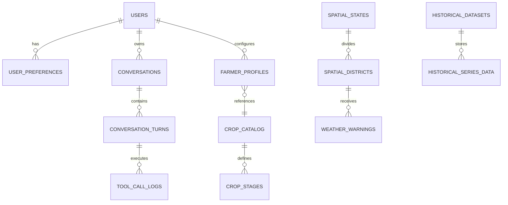

# WeatherGPT — Database Schema Specification (PostgreSQL + PostGIS)

**Document:** `10_DATABASE_SCHEMA.md`  
**Status:** Approved Technical Specification  
**Primary PRD Reference:** [docs/01_PRD.md](01_PRD.md)  
**Related Specs:** [04_INPUT_OUTPUT_CONTRACT.md](04_INPUT_OUTPUT_CONTRACT.md), [07_WEATHER_DATA_SPEC.md](07_WEATHER_DATA_SPEC.md), [09_GIS_SPEC.md](09_GIS_SPEC.md)

---

## 1. Database Architecture & Design Principles

WeatherGPT uses **PostgreSQL 16+** with the **PostGIS 3.4+** spatial extension as its primary relational and geospatial database.

1. **Strict Relational Integrity:** Enforces foreign keys, NOT NULL constraints, and domain checks across all entities.
2. **Time-Series Partitioning:** Live observations and hourly forecast tables are partitioned by range (monthly) using native PostgreSQL declarative partitioning.
3. **Dual Indexing Strategy:**
   * **B-Tree & Hash Indexes:** For primary keys, foreign keys, timestamps, and session lookups.
   * **GiST (Generalized Search Tree) Indexes:** On all spatial `geometry` columns.
   * **BRIN (Block Range Index):** On monotonically increasing historical observation timestamps.

---

## 2. Entity-Relationship Overview



---

## 3. Core Tables Specification

### 3.1 User & Session Management

```sql
-- 1. USERS TABLE
CREATE TABLE users (
    user_id UUID PRIMARY KEY DEFAULT gen_random_uuid(),
    phone_number VARCHAR(15) UNIQUE,
    email VARCHAR(255) UNIQUE,
    created_at TIMESTAMPTZ NOT NULL DEFAULT CURRENT_TIMESTAMP,
    updated_at TIMESTAMPTZ NOT NULL DEFAULT CURRENT_TIMESTAMP,
    is_active BOOLEAN NOT NULL DEFAULT TRUE
);

-- 2. USER_PREFERENCES TABLE
CREATE TABLE user_preferences (
    preference_id UUID PRIMARY KEY DEFAULT gen_random_uuid(),
    user_id UUID NOT NULL REFERENCES users(user_id) ON DELETE CASCADE,
    preferred_language VARCHAR(5) NOT NULL DEFAULT 'en' CHECK (preferred_language IN ('en', 'hi', 'bn', 'mr', 'gu')),
    default_brain VARCHAR(20) NOT NULL DEFAULT 'auto' CHECK (default_brain IN ('auto', 'general', 'farmer', 'researcher', 'analyst')),
    saved_latitude NUMERIC(8, 5) CHECK (saved_latitude BETWEEN 6.0 AND 38.0),
    saved_longitude NUMERIC(8, 5) CHECK (saved_longitude BETWEEN 68.0 AND 98.0),
    saved_location_name VARCHAR(120),
    updated_at TIMESTAMPTZ NOT NULL DEFAULT CURRENT_TIMESTAMP
);

-- 3. CONVERSATIONS TABLE
CREATE TABLE conversations (
    session_id UUID PRIMARY KEY DEFAULT gen_random_uuid(),
    user_id UUID REFERENCES users(user_id) ON DELETE SET NULL,
    started_at TIMESTAMPTZ NOT NULL DEFAULT CURRENT_TIMESTAMP,
    last_activity_at TIMESTAMPTZ NOT NULL DEFAULT CURRENT_TIMESTAMP,
    active_brain VARCHAR(20) NOT NULL DEFAULT 'auto',
    session_title VARCHAR(255),
    is_archived BOOLEAN NOT NULL DEFAULT FALSE
);

-- 4. CONVERSATION_TURNS TABLE
CREATE TABLE conversation_turns (
    turn_id UUID PRIMARY KEY DEFAULT gen_random_uuid(),
    session_id UUID NOT NULL REFERENCES conversations(session_id) ON DELETE CASCADE,
    turn_index INT NOT NULL,
    user_query TEXT NOT NULL,
    detected_language VARCHAR(5) NOT NULL,
    assigned_brain VARCHAR(20) NOT NULL,
    raw_response_json JSONB NOT NULL,
    user_feedback INT CHECK (user_feedback IN (-1, 1)),
    created_at TIMESTAMPTZ NOT NULL DEFAULT CURRENT_TIMESTAMP,
    CONSTRAINT uq_session_turn UNIQUE (session_id, turn_index)
);
```

---

### 3.2 Geospatial & Administrative Hierarchy

```sql
-- 5. SPATIAL_STATES TABLE
CREATE TABLE spatial_states (
    state_code VARCHAR(10) PRIMARY KEY, -- e.g., 'IN-GJ'
    state_name VARCHAR(100) NOT NULL,
    geom GEOMETRY(MultiPolygon, 4326) NOT NULL
);
CREATE INDEX idx_spatial_states_geom ON spatial_states USING GIST(geom);

-- 6. SPATIAL_DISTRICTS TABLE
CREATE TABLE spatial_districts (
    district_code VARCHAR(20) PRIMARY KEY, -- e.g., 'IN-GJ-24'
    state_code VARCHAR(10) NOT NULL REFERENCES spatial_states(state_code),
    district_name VARCHAR(100) NOT NULL,
    area_sqkm NUMERIC(10, 2),
    centroid_lat NUMERIC(8, 5) NOT NULL,
    centroid_lon NUMERIC(8, 5) NOT NULL,
    geom GEOMETRY(MultiPolygon, 4326) NOT NULL
);
CREATE INDEX idx_spatial_districts_geom ON spatial_districts USING GIST(geom);
CREATE INDEX idx_spatial_districts_state ON spatial_districts(state_code);
```

---

### 3.3 Agricultural & Farmer Profile Tables

```sql
-- 7. CROP_CATALOG TABLE
CREATE TABLE crop_catalog (
    crop_id SERIAL PRIMARY KEY,
    crop_name VARCHAR(80) UNIQUE NOT NULL,
    botanical_name VARCHAR(120),
    season_type VARCHAR(30) CHECK (season_type IN ('Kharif', 'Rabi', 'Zaid', 'Perennial')),
    base_temperature_c NUMERIC(4, 1) DEFAULT 10.0
);

-- 8. CROP_STAGES TABLE
CREATE TABLE crop_stages (
    stage_id SERIAL PRIMARY KEY,
    crop_id INT NOT NULL REFERENCES crop_catalog(crop_id) ON DELETE CASCADE,
    stage_name VARCHAR(80) NOT NULL,
    stage_order INT NOT NULL,
    kc_coefficient NUMERIC(4, 2) NOT NULL,
    critical_water_stage BOOLEAN NOT NULL DEFAULT FALSE,
    susceptible_to_waterlogging BOOLEAN NOT NULL DEFAULT TRUE,
    CONSTRAINT uq_crop_stage UNIQUE (crop_id, stage_order)
);

-- 9. FARMER_PROFILES TABLE
CREATE TABLE farmer_profiles (
    profile_id UUID PRIMARY KEY DEFAULT gen_random_uuid(),
    user_id UUID NOT NULL REFERENCES users(user_id) ON DELETE CASCADE,
    crop_id INT REFERENCES crop_catalog(crop_id),
    current_stage_id INT REFERENCES crop_stages(stage_id),
    sowing_date DATE,
    soil_type VARCHAR(50) DEFAULT 'black_clay' CHECK (soil_type IN ('alluvial', 'black_clay', 'red_loam', 'sandy_loam', 'laterite')),
    irrigation_method VARCHAR(50) DEFAULT 'flood' CHECK (irrigation_method IN ('drip', 'sprinkler', 'flood', 'rainfed')),
    farm_size_acres NUMERIC(6, 2),
    last_irrigation_date DATE,
    updated_at TIMESTAMPTZ NOT NULL DEFAULT CURRENT_TIMESTAMP
);
```

---

### 3.4 Warnings, Weather Forecasts & Provenance

```sql
-- 10. WEATHER_WARNINGS TABLE (IMD CAP Ingestion)
CREATE TABLE weather_warnings (
    warning_id VARCHAR(100) PRIMARY KEY,
    source VARCHAR(50) NOT NULL DEFAULT 'IMD',
    district_code VARCHAR(20) REFERENCES spatial_districts(district_code),
    hazard_type VARCHAR(80) NOT NULL,
    warning_color VARCHAR(10) NOT NULL CHECK (warning_color IN ('Green', 'Yellow', 'Orange', 'Red')),
    severity VARCHAR(30) NOT NULL,
    headline TEXT NOT NULL,
    description TEXT NOT NULL,
    effective_from TIMESTAMPTZ NOT NULL,
    expires_at TIMESTAMPTZ NOT NULL,
    polygon_geom GEOMETRY(Polygon, 4326),
    ingested_at TIMESTAMPTZ NOT NULL DEFAULT CURRENT_TIMESTAMP
);
CREATE INDEX idx_weather_warnings_geom ON weather_warnings USING GIST(polygon_geom);
CREATE INDEX idx_weather_warnings_active ON weather_warnings(expires_at, warning_color);

-- 11. TOOL_CALL_LOGS TABLE
CREATE TABLE tool_call_logs (
    call_id UUID PRIMARY KEY DEFAULT gen_random_uuid(),
    turn_id UUID NOT NULL REFERENCES conversation_turns(turn_id) ON DELETE CASCADE,
    tool_name VARCHAR(80) NOT NULL,
    caller_brain VARCHAR(20) NOT NULL,
    arguments JSONB NOT NULL,
    execution_time_ms NUMERIC(8, 2) NOT NULL,
    status VARCHAR(20) NOT NULL CHECK (status IN ('success', 'error', 'cached')),
    error_message TEXT,
    created_at TIMESTAMPTZ NOT NULL DEFAULT CURRENT_TIMESTAMP
);
CREATE INDEX idx_tool_call_logs_brain ON tool_call_logs(caller_brain, tool_name);
```

---

## 4. Partitioning & Data Retention Strategy

1. **Weather Forecasts & Telemetry Partitioning:** Partitioned monthly by `observation_time` / `forecast_reference_time`.
2. **Data Retention Rules:**
   * Raw 15-minute observations are retained for $90\text{ days}$, then rolled up into daily aggregate tables (`daily_weather_summaries`).
   * Tool execution logs and raw debug traces are retained for $30\text{ days}$.
   * Historical climate series and IMD gridded reference data are retained permanently.
