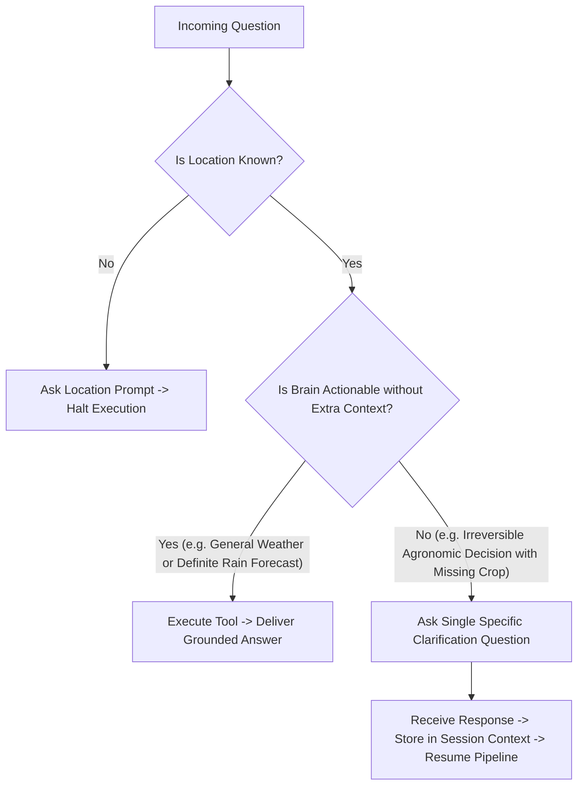

# WeatherGPT — Personalization & Progressive Context Specification

**Document:** `12_PERSONALIZATION_SPEC.md`  
**Status:** Approved Technical Specification  
**Primary PRD Reference:** [docs/01_PRD.md](01_PRD.md)  
**Related Specs:** [03_LLM_BRAIN_SPEC.md](03_LLM_BRAIN_SPEC.md), [04_INPUT_OUTPUT_CONTRACT.md](04_INPUT_OUTPUT_CONTRACT.md), [10_DATABASE_SCHEMA.md](10_DATABASE_SCHEMA.md)

---

## 1. Personalization Principles & Non-Negotiable Rules

WeatherGPT is designed around **Progressive & Optional Personalization**.

```text
┌────────────────────────────────────────────────────────────────────────────┐
│                       CORE PERSONALIZATION RULES                           │
├────────────────────────────────────────────────────────────────────────────┤
│ 1. Zero Onboarding Friction: A user can immediately ask any weather       │
│    question upon launching the app without filling a registration form.    │
│ 2. Ask Only When Materially Required: Never prompt the user for optional   │
│    fields (e.g. soil type, farm size) if the weather forecast alone is     │
│    sufficient to safely answer the user's question.                        │
│ 3. Progressive Discovery: Context is collected organically through         │
│    natural conversational turns and preserved in the session cache.        │
│ 4. Privacy & Data Minimization: Farm locations and asset coordinates are   │
│    never monetized, shared with third parties, or exposed to the client.   │
└────────────────────────────────────────────────────────────────────────────┘
```

---

## 2. Personalization Taxonomy by Domain Brain

### 2.1 Farmer Brain Personalization Attributes
| Context Field | Tier | Default Fallback if Missing | When to Ask Conversational Clarification |
| :--- | :---: | :--- | :--- |
| **Farm Location** | Mandatory | Device GPS or User City | Immediately if location is missing from query and GPS is denied. |
| **Crop Name** | Mandatory (for Ag advice) | None (Prompts user) | When query asks for irrigation/spray/disease advisory without naming crop. |
| **Crop Growth Stage** | Progressive | Regional seasonal stage | When crop is known but advice depends critically on stage (e.g., flowering). |
| **Soil Type** | Optional | Regional dominant soil (e.g. Black Clay)| Never block query; assume regional soil default and state assumption. |
| **Irrigation Method**| Optional | Flood / Furrow | Never block query; state recommendation in standard millimetres. |
| **Last Irrigation Date**| Optional | 7 days ago | Ask only if soil moisture is borderline and no rain is forecast. |

### 2.2 Researcher Brain Personalization Attributes
| Context Field | Tier | Default Fallback | Purpose |
| :--- | :---: | :--- | :--- |
| **Baseline Climate Period** | Optional | $1991–2020$ (WMO Standard Normal) | Climate anomaly reference baseline |
| **Preferred Gridded Dataset**| Optional | IMD Gridded $0.25^\circ \times 0.25^\circ$ | Primary historical data source |
| **Significance Level ($\alpha$)**| Optional | $\alpha = 0.05$ ($95\%$ Confidence) | Mann-Kendall hypothesis testing |
| **Export Format** | Optional | `CSV` (Comma-Separated Values) | Dataset download structure |

### 2.3 Analyst Brain Personalization Attributes
| Context Field | Tier | Default Fallback | Purpose |
| :--- | :---: | :--- | :--- |
| **Organization / Domain** | Optional | Disaster Management / Civil Admin | Tailors impact explanation focus |
| **Area of Interest (AOI)** | Mandatory | Target District Boundary | Focuses PostGIS spatial bounding box |
| **Rainfall Hazard Threshold**| Optional | IMD Heavy Rain Standard ($\ge 64.5\text{ mm}$)| Triggers high-priority alerts |
| **Exposure Focus Layers** | Optional | Population & National Highways | Focuses GIS intersection output |

### 2.4 General Brain Personalization Attributes
| Context Field | Tier | Default Fallback | Purpose |
| :--- | :---: | :--- | :--- |
| **Preferred Language** | Optional | System Locale / Detected Input Lang | Text & voice output language |
| **Default Location** | Optional | Auto-detected GPS coordinate | Default home screen weather card |
| **Units Preference** | Optional | Metric (°C, mm, km/h) | Presentation formatting |

---

## 3. Progressive Questioning Decision Engine



### 3.1 Concrete Scenarios: When to Ask vs. When NOT to Ask

#### Scenario A: Rain Forecast Overrides Need for Crop Details (Do NOT Ask)
* **User Query:** *"Should I irrigate my field tomorrow in Rajkot?"*
* **Forecast Evidence:** IMD Orange Alert, $55\text{ mm}$ rainfall forecast tomorrow ($90\%$ probability).
* **System Action:** **Do NOT ask for crop or soil details.** Heavy rainfall ($55\text{ mm}$) supersedes crop differences.
* **Response:** *"Do not irrigate tomorrow in Rajkot. Heavy rainfall of around 55 mm is forecast (Orange Alert), which will provide abundant moisture and risks waterlogging."*

#### Scenario B: Critical Stage Sensitivity (Ask Single Specific Question)
* **User Query:** *"Should I apply urea fertilizer to my wheat tomorrow in Karnal?"*
* **Forecast Evidence:** Weather is dry ($22^\circ\text{C}$, clear skies, no rain).
* **Missing Context:** Growth Stage (Fertilizer application is beneficial during Tillering/CRI but wasteful or damaging near maturity).
* **System Action:** **Ask for growth stage only.**
* **Prompt:** *"To give the exact fertilizer timing, what growth stage is your wheat currently in (e.g., Crown Root Initiation, Tillering, or Flowering)?"*

---

## 4. Context Storage, Lifecycles & Expiration

```text
┌────────────────────────────────────────────────────────────────────────────┐
│                        CONTEXT STORAGE LIFECYCLE                           │
├────────────────────────────────────────────────────────────────────────────┤
│ 1. Ephemeral Turn Context: Injected parameters active for single turn      │
│    (e.g., temporary date overrides like "next Friday"). Expired in 1 turn. │
│                                                                            │
│ 2. Session Context (Redis): Active for ongoing conversation session        │
│    (e.g., resolved location, crop name). TTL = 24 hours of inactivity.     │
│                                                                            │
│ 3. Persistent User Profile (PostgreSQL): Stored preferences explicitly    │
│    saved by user (e.g., saved farm, preferred language). Permanent until   │
│    updated or deleted by user.                                             │
└────────────────────────────────────────────────────────────────────────────┘
```
