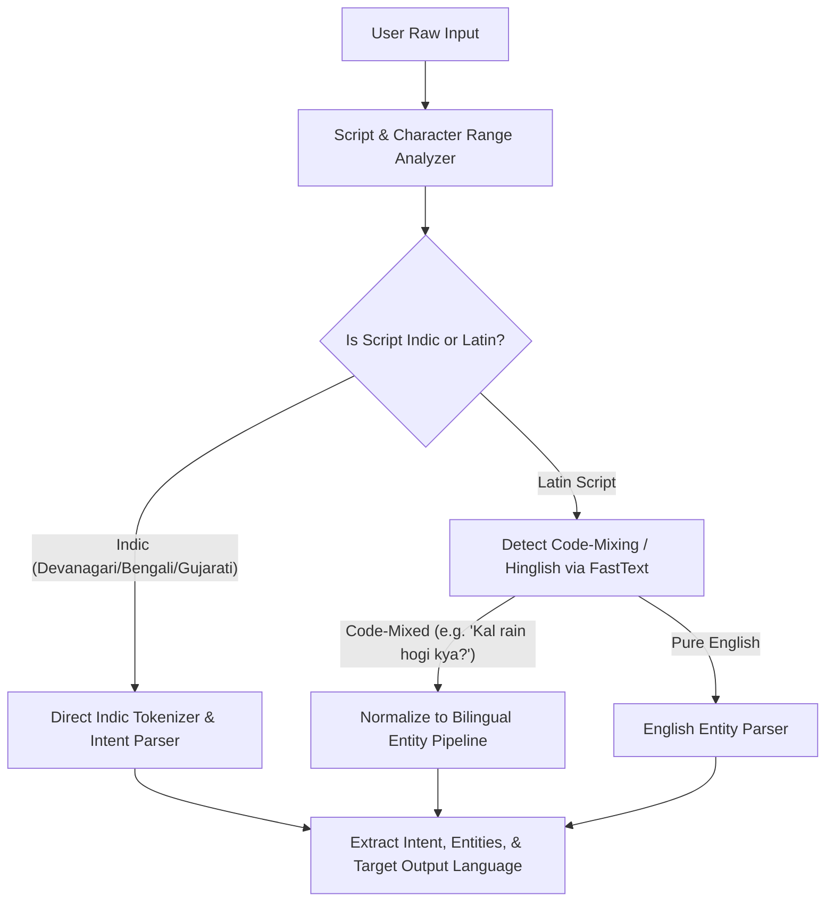

# WeatherGPT — Multilingual Intelligence Specification

**Document:** `13_MULTILINGUAL_SPEC.md`  
**Status:** Approved Technical Specification  
**Primary PRD Reference:** [docs/01_PRD.md](01_PRD.md)  
**Related Specs:** [03_LLM_BRAIN_SPEC.md](03_LLM_BRAIN_SPEC.md), [04_INPUT_OUTPUT_CONTRACT.md](04_INPUT_OUTPUT_CONTRACT.md), [07_WEATHER_DATA_SPEC.md](07_WEATHER_DATA_SPEC.md)

---

## 1. Multilingual Philosophy & Core Invariant

Language in WeatherGPT is strictly an **accessibility and communicative interface layer**.

```text
┌────────────────────────────────────────────────────────────────────────────┐
│                    THE METEOROLOGICAL EVIDENCE INVARIANT                   │
├────────────────────────────────────────────────────────────────────────────┤
│ 1. Numerical Invariance: A forecast of 38.4 mm of rain is 38.4 mm in      │
│    English, 38.4 मिमी in Hindi, 38.4 মিমি in Bengali, and 38.4 મીમી in     │
│    Gujarati. Translation MUST NEVER round, shift, or fabricate numbers.    │
│ 2. Warning Level Invariance: An official IMD "Orange Alert" (Be Prepared)  │
│    is NEVER translated into a mild advisory or altered in severity.        │
│ 3. Semantic Grounding: All domain-specific terms (agronomic stages, weather│
│    hazards) adhere to standardized regional glossaries.                    │
└────────────────────────────────────────────────────────────────────────────┘
```

---

## 2. Supported MVP Languages & Scripts

| Language | ISO Code | Native Name | Script | Regional Priority in India |
| :--- | :---: | :--- | :--- | :--- |
| **English** | `en` | English | Latin | National / Pan-India / Research |
| **Hindi** | `hi` | हिन्दी | Devanagari | North, Central, & Western India |
| **Bengali** | `bn` | বাংলা | Bengali-Assamese | West Bengal, Tripura, Eastern India |
| **Marathi** | `mr` | मराठी | Devanagari | Maharashtra & Central India |
| **Gujarati**| `gu` | ગુજરાતી | Gujarati | Gujarat, Daman & Diu |

---

## 3. Language Detection & Code-Mixed Parsing



### 3.1 Code-Mixed Exemplars & Normalization

| Raw User Query | Detected Lang / Script | Normalized Intent | Extracted Entities | Target Response Lang |
| :--- | :--- | :--- | :--- | :---: |
| *"Kal mere wheat me irrigation karna chahiye kya?"* | Hinglish (Latin) | `irrigation_advisory` | `date: tomorrow`, `crop: wheat` | Hindi (`hi`) |
| *"Ahmedabad ma aavti kaale varsad padshe?"* | Gujarati (Latin) | `daily_forecast` | `location: Ahmedabad`, `date: tomorrow`| Gujarati (`gu`)|
| *"Pune madhe udya paus padel ka?"* | Marathi (Latin) | `daily_forecast` | `location: Pune`, `date: tomorrow` | Marathi (`mr`)|
| *"আগামীকাল কি বৃষ্টি হবে?"* | Bengali (Bengali) | `daily_forecast` | `date: tomorrow` | Bengali (`bn`)|

---

## 4. Standardized Terminology Glossaries

### 4.1 Official IMD Weather Warning Terminology

| Warning Level | English (`en`) | Hindi (`hi`) | Bengali (`bn`) | Marathi (`mr`) | Gujarati (`gu`) |
| :--- | :--- | :--- | :--- | :--- | :--- |
| **Green** | Clear / No Warning | कोई चेतावनी नहीं | কোনো সতর্কতা নেই | कोणतीही चेतावणी नाही | કોઈ ચેતવણી નથી |
| **Yellow** | Watch / Be Updated | सचेत रहें (येलो अलर्ट) | সতর্ক থাকুন (হলুদ সতর্কবার্তা) | जागरूक राहा (पिवळा इशारा) | સાવચેત રહો (યલો એલર્ટ) |
| **Orange** | Alert / Be Prepared | तैयार रहें (ऑरेंज अलर्ट) | প্রস্তুত থাকুন (কমলা সতর্কবার্তা)| तयार राहा (केशरी इशारा) | તૈયાર રહો (ઓરેન્જ એલર્ટ) |
| **Red** | Warning / Take Action | सतर्क रहें / कार्रवाई करें (रेड अलर्ट) | দ্রুত পদক্ষেপ নিন (লাল সতর্কতা) | त्वरित कारवाई करा (लाल इशारा) | તાત્કાલિક પગલાં લો (રેડ એલર્ટ) |

### 4.2 Standard Meteorological Classifications

| Hazard / Phenomenon | English (`en`) | Hindi (`hi`) | Bengali (`bn`) | Marathi (`mr`) | Gujarati (`gu`) |
| :--- | :--- | :--- | :--- | :--- | :--- |
| **Light Rain** | Light Rain | हल्की वर्षा | হালকা বৃষ্টি | हलका पाऊस | હળવો વરસાદ |
| **Moderate Rain** | Moderate Rain | मध्यम वर्षा | মাঝারি বৃষ্টি | मध्यम पाऊस | મધ્યમ વરસાદ |
| **Heavy Rain** | Heavy Rain | भारी वर्षा | ভারী বৃষ্টি | मुसळधार पाऊस | ભારે વરસાદ |
| **Very Heavy Rain** | Very Heavy Rain | बहुत भारी वर्षा | অতি ভারী বৃষ্টি | अति मुसळधार पाऊस | અતિ ભારે વરસાદ |
| **Thunderstorm** | Thunderstorm / Lightning | गरज के साथ बिजली | বজ্রবিদ্যুৎ সহ ঝড় | मेघगर्जनेसह विजा | ગાજવીજ સાથે વાવાઝોડું |
| **Heatwave** | Heatwave | लू / ताप लहर | তাপপ্রবাহ | उष्णतेची लाट | હીટવેવ / લૂ |
| **Coldwave** | Coldwave | शीत लहर | শৈত্যপ্রবাহ | थंडीची लाट | કોલ્ડવેવ / શીત લહેર |

### 4.3 Key Agronomic Terms

| Agronomic Concept | English (`en`) | Hindi (`hi`) | Bengali (`bn`) | Marathi (`mr`) | Gujarati (`gu`) |
| :--- | :--- | :--- | :--- | :--- | :--- |
| **Irrigation** | Irrigation | सिंचाई | সেচ | सिंचन / पाणी देणे | પિયત / સિંચાઈ |
| **Sowing** | Sowing | बुवाई | বপন | पेरणी | વાવણી |
| **Harvesting** | Harvesting | कटाई | ফসল তোলা | कापणी | લણણી / કાપણી |
| **Pesticide Spray** | Chemical Spraying | कीटनाशक छिड़काव | কীটনাশক স্প্রে | कीटकनाशक फवारणी | જંતુનાશક છંટકાવ |
| **Waterlogging** | Waterlogging | जलभराव | জল জমা / জলাবদ্ধতা | शेतात पाणी साचणे | પાણી ભરાવો |
| **Soil Moisture** | Soil Moisture | मिट्टी की नमी | মাটির আর্দ্রতা | मातीतील ओलावा | જમીનનો ભેજ |

---

## 5. Numerical & Date Localization Standards

1. **Numerical Data Integrity:** In the JSON output schema, all numbers under `"data"` remain standard ASCII floating-point numbers (e.g., `35.2`). In the conversational `"answer"` and `"summary"` fields, numbers are presented clearly with localized unit symbols:
   * Hindi: `35.2 मिमी`, `32°C`, `18 किमी/घंटा`
   * Bengali: `৩৫.২ মিমি`, `৩২°C`, `১৮ কিমি/ঘণ্টা`
   * Gujarati: `૩૫.૨ મીમી`, `૩૨°C`, `૧૮ કિમી/કલાક`
   * Marathi: `३५.२ मिमी`, `३२°C`, `१८ किमी/तास`
2. **Date & Time Localization:** Explicitly localized to India Standard Time (IST):
   * Hindi: `30 अगस्त 2026, शाम 5:30 बजे`
   * Gujarati: `૩૦ ઓગસ્ટ ૨૦૨૬, સાંજે ૫:૩૦ વાગ્યે`
