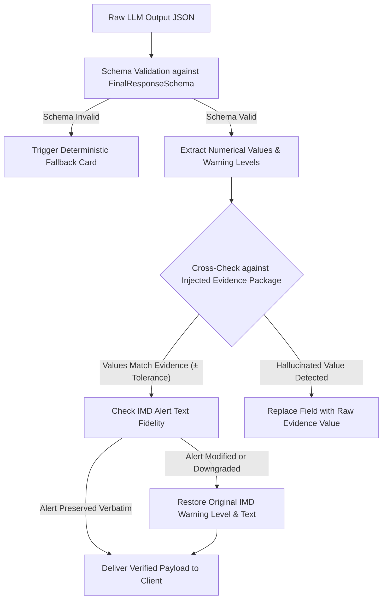

# WeatherGPT — Error Handling & Guardrails Specification

**Document:** `15_ERROR_GUARDRAILS.md`  
**Status:** Approved Technical Specification  
**Primary PRD Reference:** [docs/01_PRD.md](01_PRD.md)  
**Related Specs:** [03_LLM_BRAIN_SPEC.md](03_LLM_BRAIN_SPEC.md), [04_INPUT_OUTPUT_CONTRACT.md](04_INPUT_OUTPUT_CONTRACT.md), [07_WEATHER_DATA_SPEC.md](07_WEATHER_DATA_SPEC.md)

---

## 1. Safety Philosophy & Systematic Guardrails

WeatherGPT enforces strict structural and deterministic safety guardrails. Because weather and agricultural decisions affect human safety and livelihoods, the system adopts a **defense-in-depth failure architecture**.

```text
┌────────────────────────────────────────────────────────────────────────────┐
│                         FIVE CORE SAFETY MANDATES                          │
├────────────────────────────────────────────────────────────────────────────┤
│ 1. NEVER Fabricate Weather Values: If data cannot be retrieved, state the  │
│    failure explicitly. Never generate plausible-sounding weather numbers. │
│ 2. NEVER Alter Authoritative Warnings: Official IMD warning levels         │
│    (Yellow, Orange, Red) are immutable. No LLM may downgrade or cancel.   │
│ 3. NEVER Claim Unsupported Precision: Do not promise village- or acre-     │
│    level precipitation certainty when data resolution is 27 km.            │
│ 4. NEVER Emit Dangerous Agronomic Guidance: Withhold chemical/irrigation   │
│    action if critical context is missing during high-risk weather.         │
│ 5. NEVER Conceal Data Disagreements or Staleness: Visibly disclose model   │
│    divergence and data retrieval timestamps.                               │
└────────────────────────────────────────────────────────────────────────────┘
```

---

## 2. Comprehensive Failure & Action Decision Matrix

| Failure / Context Scenario | System Behavior | Fallback / Action Executed | User-Facing Communication |
| :--- | :---: | :--- | :--- |
| **Missing Mandatory Location** | **Ask** | Halt tool execution; emit structured location picker. | *"Please provide your city, district, or allow GPS access to check the weather."* |
| **Missing Target Date / Window** | **Fallback** | Default to current time + next 24/72 hours. | Explicitly label response as *"Forecast for Next 24 Hours (Today & Tomorrow)"*. |
| **IMD Alert Feed Unreachable** | **Explain Limitation** | Serve secondary NWP weather data; **explicitly flag lack of official alert status**. | *"⚠️ Official IMD warning feed is temporarily offline. Weather data is from secondary models; please verify extreme weather alerts with official IMD bulletins."* |
| **Primary Weather Ingest Fails** | **Fallback** | Fetch from Redis rolling cache ($< 3\text{h}$ old); if empty, switch to secondary adapter. | *"Data updated at 08:30 IST (Cached)"* |
| **NWP Model Disagreement ($DR > 0.65$)** | **Explain Limitation** | Present multi-model range without averaging. | *"Models diverge: GFS forecasts 45mm rain while ECMWF indicates 12mm. Prepare for moderate to heavy showers."* |
| **PostGIS Spatial Engine Error** | **Fallback** | Fall back to district centroid lookup; suppress vector intersection map. | Provide tabular district metrics with a note: *"Detailed spatial map rendering is currently unavailable."* |
| **LLM Inference Server Down / Timeout** | **Fallback** | Bypass LLM; render deterministic UI cards directly from Tool Gateway results. | Deliver standard weather card and numerical summary without conversational prose. |
| **Unsupported Farm Precision Query** | **Refuse / Clarify**| Refuse exact 1-meter point claims; explain grid scale. | *"Weather models operate at a 27 km grid scale; local showers may vary slightly across your tehsil."* |
| **Crop Chemical Prescription Query** | **Refuse / Guard** | Refuse chemical diagnosis; evaluate only atmospheric spray windows. | *"I can evaluate weather suitability for spraying (wind/rain), but cannot prescribe specific chemical dosages. Consult your local Krishi Vigyan Kendra (KVK)."* |

---

## 3. Output Hallucination Prevention & Grounding Verification

Before any LLM-generated response is delivered to the mobile client, it passes through the **Evidence & Output Guard Validator**:



### 3.1 Numerical Value Verification Rules
1. **Temperature Validation:** Any temperature mentioned in the text must match `forecast.temperature_max_c` or `forecast.temperature_min_c` within $\pm 0.5^\circ\text{C}$.
2. **Rainfall Sum Validation:** Rainfall numbers in text must match `forecast.rainfall_total_mm` within $\pm 1.0\text{ mm}$.
3. **Regex Extraction Scan:** An automated regex scanner flags any unregistered currency, drug names, or ungrounded statistics.

---

## 4. Agricultural Safety & Advisory Bounds

1. **Spray Window Boundary:** If forecasted wind speeds exceed $15\text{ km/h}$ or rain probability is $\ge 30\%$ within 4 hours, the advisory action is hard-locked to **`UNSUITABLE`**. The LLM is forbidden from overriding this to "suitable".
2. **Frost & Heatwave Alerts:** If temperature drops below $4.0^\circ\text{C}$ or exceeds $42.0^\circ\text{C}$, the system automatically attaches standard non-chemical cultural practices (e.g. light evening irrigation for frost protection, shade netting for heat protection).
