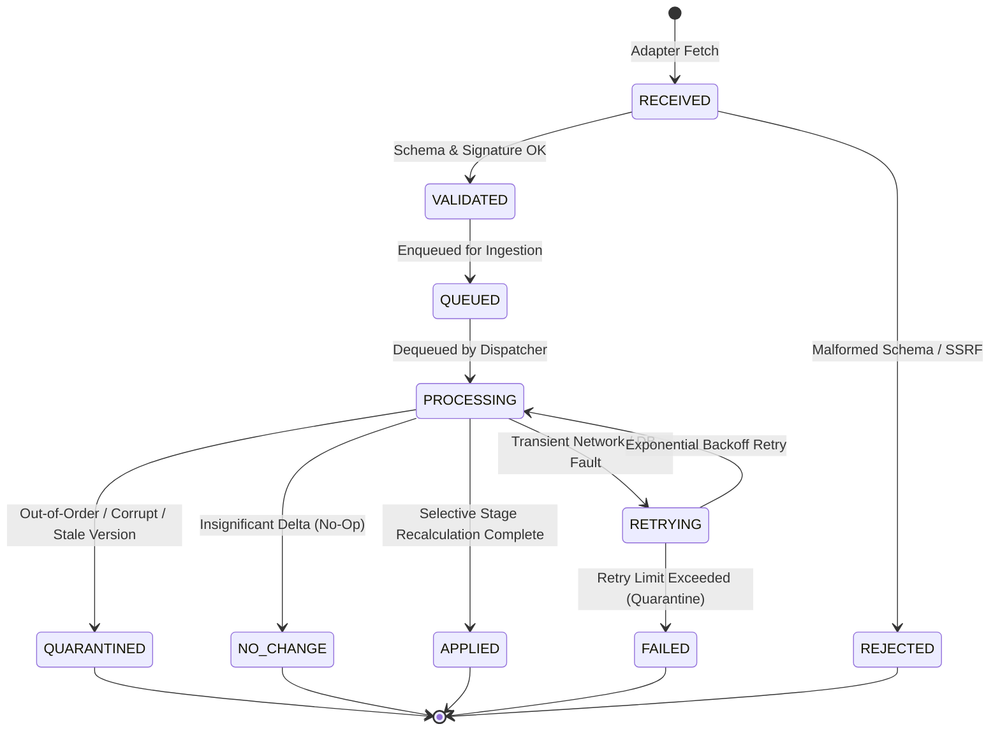

# PHASE 9C — EVENT PROCESSING STATE MACHINE

## 1. Lifecycle State Definitions

---

## 2. Transition Rules

1. **`RECEIVED -> VALIDATED`**: Inbound payload is verified against the typed contract and authenticated origin.
2. **`RECEIVED -> REJECTED`**: Dropped immediately if payload exceeds 5MB or fails cryptographic signature validation.
3. **`PROCESSING -> QUARANTINED / STALE`**:
   - Out-of-order versioning: Incoming `event_version < latest_version` (marked `STALE`).
   - Stale observation: Incoming `observed_at < latest_observed_at`.
   - Payload or schema corruption: quarantined to DLQ.
   - Retained in dead-letter quarantine for operational inspection without corrupting current state.
4. **`PROCESSING -> CONFLICT`**:
   - Conflicting concurrent events from competing sources without clear authority hierarchy.
5. **`PROCESSING -> NO_CHANGE`**:
   - Weather variable delta is below significance thresholds (e.g. rain delta < 2.5 mm, temp delta < 1.5°C).
   - Event is marked `NO_CHANGE` with recalculation `NO_OP`.
6. **`PROCESSING -> APPLIED`**:
   - Significant change detected. Selective pipeline re-run succeeds and updates decision revision.
