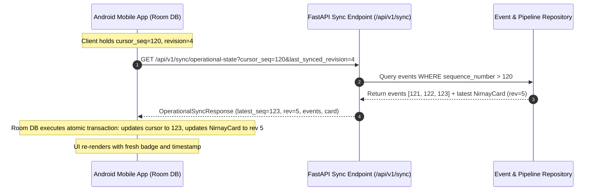

# PHASE 9C — INCREMENTAL SYNCHRONIZATION PROTOCOL

## 1. Protocol Overview
The VAYUBODHAK mobile synchronization protocol provides efficient, bandwidth-optimized synchronization between the central backend and Android field clients.

---

## 2. Cursor Handshake Flow

---

## 3. Disconnect & Offline Recovery

When mobile device loses network connectivity:
1. Client detects network offline state via `ConnectivityManager`.
2. UI displays local cached NirnayCard with badge `CACHED` and header:
   `"OFFLINE — LAST VERIFIED [2026-09-21 14:30 UTC]"`.
3. Cached data is explicitly labeled; never masquerades as live data.
4. When connectivity returns:
   Client resumes handshake from `cursor_seq = 120`, avoiding full dataset re-download.
